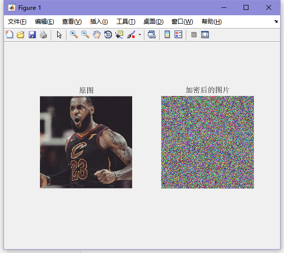
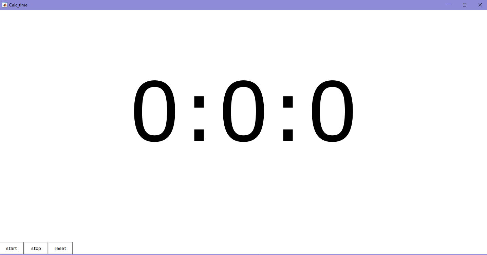

# tools-matlab
本仓库主要包含一些本人在学习过程中使用matlab写的小程序。

主要有几大类：

## 一，二维恒虚警检测

二维CA-CFAR目标检测过程仿真，随机信号处理研究生上机作业

恒虚警检测：雷达二维图像平面存储在“radar_image.mat”文件中，二维矩阵的横坐标和纵坐标方向分别距离和多普勒。 

要求：

 1.给出对上述雷达图像进行单元平均恒虚警检测的流程框图。 

2.画出检测门限分别为8dB, 10dB 和 12dB 时的二维恒虚警检测结果。 

注意：

 1、白噪声加入采用randn函数；2、整体产生回波，再整体加时延和多卜勒信息；3、通过数据分析计算出各级信噪比； 格式要求： 1、封面、目录、写上题目；2、理论分析；3、仿真程序；4、仿真结果和理论间的对比分析

## 二，混沌算法加密图像

### 程序1  -  CHAOS.fig+CHAOS.m

混沌算法加密使用方法：

1. 选择待加密的图片
2. 输入密码，密码为0~1内的小数
3. 然后点击加密即可

混沌算法解密使用方法：

1. 选择待解密的图片
2. 输入密码，密码为0~1内的小数
3. 然后点击解密即可

### 其他程序

混沌算法加密图像文件夹中除了上述加密程序外，还有许多测试代码，在这里并不一一介绍，有兴趣的读者可以自行运行测试。

## 三，计算器程序

语音计算器程序：

## 四，史密斯圆计算

史密斯圆图是Phillip Smith发明的用于简化各种系统和电路的阻抗匹配电路计算的一种图形化工具，其建立在反射系数复平面（Гr，Гi）上，由阻抗圆图、导纳圆图和等反射系数圆叠加而成。

### 程序1 - wo.m+ wo.fig

% 1.必须首先单击坐标轴上方的“阻抗圆图/导纳圆图”切换按钮，选择要显示的圆图类别。（因为计算时会用到这个变量，如果没有这个值程序运行会出错）
		% 2.在相应模块输入或选择数据或选择，再点击相应模块的按钮。要求可编辑文本框中输入的数据是数字即可，另外由于归一化的操作比较简单，所以本程序不含归一化操作步骤，默认输入的阻抗值都是归一化后的。
		% 3.输入结果说明：程序中的有关长度（如输入端距负载的距离d,支节长度l不是绝对的而是以λ为单位，即真正的结果是显示的计算结果×λ。
		% 4.由于本程序设计的不完善，特别是对鼠标点击的响应、程序的控制还不够健壮，所以在使用过程中如果不按照以下说明使用则会出错。
		% （1）在一个计算进行过程中不能点击坐标轴上的“阻抗圆图/导纳圆图”切换按钮，否则虽然计算结果是正确的但是动态演示的绘图已经出错。同样在一个计算进行过程中不能更改输入数据，否则，不仅动态演示的绘图会出错，计算结果也会出错。
		% （2）在一个计算过程进行过程中不能关闭此图形窗口，否则会报错。

### 程序2 - My-smith.m+MY-smith.fig

该程序功能比较完善，输入参数即可计算出相应结果。

### 程序3：smithyyq

## 五，时钟程序

### 程序1：CLOC

这是一个计时小程序：

### 程序2：CLOC2

桌面圆形时钟程序：

### 程序3：CLOC3

### 程序4：clock1.m

### 程序5：timing.m

闹钟程序：

